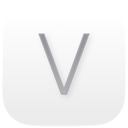
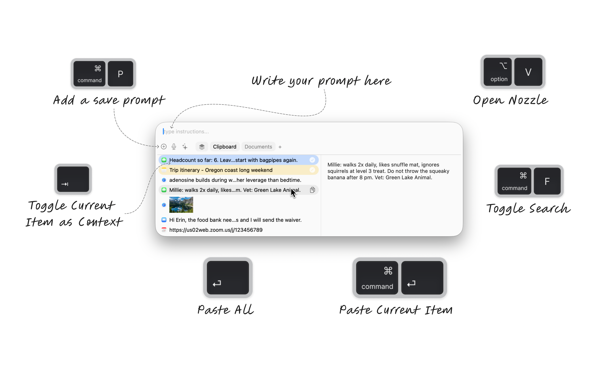

<p align="center">
  
</p>

<h1 align="center">nozzle</h1>

<p align="center">
  <strong>A powerful content aggregation tool for macOS</strong>
</p>

<p align="center">
  <a href="https://github.com/conmeara/nozzle/releases/latest"></a>
  <a href="https://github.com/conmeara/nozzle/releases/latest"></a>
  <a href="LICENSE"></a>
</p>

<p align="center">
  <video src="nozzle/Onboarding/NozzleDemo.mp4" controls width="900"></video>
</p>

---

nozzle is a lightweight, keyboard-driven content manager for macOS that combines clipboard history with file system monitoring in a unified interface. Select, search, and combine content from multiple sources with ease.

**Requires macOS 26.0 or later.**

<p align="center">
  
</p>

## Features

- **Clipboard History** — Access your copy history instantly with fuzzy search
- **Folder Monitoring** — Watch directories and access files alongside clipboard content
- **Multi-Select** — Select items from any source and combine them
- **Prompt Mode** — Add instructions to combine with selected content
- **Keyboard-First** — Navigate entirely with keyboard shortcuts
- **Native & Fast** — Built with SwiftUI for a lightweight, responsive experience
- **Auto-Updates** — Stay current with built-in Sparkle updates

## Install

Download the latest version from the [Releases](https://github.com/conmeara/nozzle/releases/latest) page.

**Note:** The app is currently unsigned. After downloading, you'll need to remove the quarantine attribute:

```bash
xattr -cr /Applications/nozzle.app
```

Then open the app normally. Alternatively, right-click the app and select "Open" to bypass Gatekeeper.

## Quick Start

1. **Open nozzle** — Press <kbd>⇧</kbd><kbd>⌘</kbd><kbd>C</kbd> or click the menu bar icon
2. **Search** — Start typing to filter items
3. **Select** — Press <kbd>Enter</kbd> to copy, <kbd>⌥</kbd><kbd>Enter</kbd> to paste
4. **Multi-select** — Press <kbd>Tab</kbd> to toggle item selection
5. **Preferences** — Press <kbd>⌘</kbd><kbd>,</kbd> to customize

## Keyboard Shortcuts

| Action | Shortcut |
|--------|----------|
| Open nozzle | <kbd>⇧</kbd><kbd>⌘</kbd><kbd>C</kbd> |
| Copy item | <kbd>Enter</kbd> |
| Paste item | <kbd>⌥</kbd><kbd>Enter</kbd> |
| Paste without formatting | <kbd>⌥</kbd><kbd>⇧</kbd><kbd>Enter</kbd> |
| Toggle selection | <kbd>Tab</kbd> |
| Select nth item | <kbd>⌘</kbd><kbd>1-9</kbd> |
| Clear selections | <kbd>⌘</kbd><kbd>⌫</kbd> |
| Toggle search/prompt mode | <kbd>⌘</kbd><kbd>F</kbd> |
| Combined paste | <kbd>⌘</kbd><kbd>V</kbd> |
| Combined copy | <kbd>⌘</kbd><kbd>Enter</kbd> |
| Preview | <kbd>⌥</kbd><kbd>Space</kbd> |
| Delete item | <kbd>⌥</kbd><kbd>⌫</kbd> |
| Open preferences | <kbd>⌘</kbd><kbd>,</kbd> |

## FAQ

**Why doesn't it paste automatically?**
1. Enable "Paste automatically" in Preferences
2. Add nozzle to System Settings → Privacy & Security → Accessibility

## Contributing

Contributions are welcome! Please feel free to submit a Pull Request.

### Development

```sh
# Clone the repository
git clone https://github.com/conmeara/nozzle.git
cd nozzle

# Open in Xcode
open nozzle.xcodeproj

# Build
xcodebuild -project nozzle.xcodeproj -scheme nozzle build

# Run tests
xcodebuild -project nozzle.xcodeproj -scheme nozzle test
```

## Acknowledgments

nozzle is a fork of [Maccy](https://github.com/p0deje/Maccy) by [p0deje](https://github.com/p0deje). Thank you for creating such a solid foundation for clipboard management on macOS.

## License

[MIT](LICENSE) — see the [LICENSE](LICENSE) file for details.
